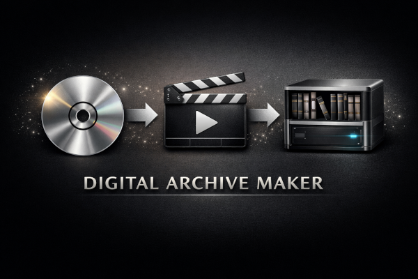

<p align="center">
  
</p>

<p align="center">
Turn your CDs, DVDs, and Blu-rays into a convenient digital library you can access from anywhere.
</p>

<div align="center">

[](https://opensource.org/licenses/GPL-2.0)
[](CHANGELOG.md)
[](https://www.apple.com/macos/)
[](https://www.python.org/downloads/)

</div>

<p align="center">
  <a href="QUICKSTART.md">Quick Start</a> ·
  <a href="docs/">Documentation</a> ·
  <a href="CONTRIBUTING.md">Contributing</a> ·
  <a href="DISCLAIMER.md">Disclaimer</a> ·
  <a href="SECURITY.md">Security</a>
</p>

---

## About

**Digital Archive Maker** transforms your physical media collection into an organized digital library you can stream anywhere.

**The Problem:** Your CDs, DVDs, and Blu-rays sit on shelves, collecting dust. They're difficult to browse and can't be searched.

**The Reality:** Traditional digitization requires wrestling with dozens of tools that don't talk to each other.

**The Solution:** Digital Archive Maker automates everything:
- **Extract** high-quality digital files from physical discs
- **Organize** everything with names, metadata, and artwork  
- **Tag** each item with rich details from online databases
- **Structure** files for media servers like Jellyfin and Plex
- **Sync** your library to devices you actually use

**What it does:**
- 🎵 **CDs to FLAC** — Lossless audio with album art and metadata
- 📀 **DVDs/Blu-rays to MP4** — High-quality video with subtitles
- 🏷️ **Rich metadata** — Artist bios, movie descriptions, genres, ratings
-️ **Smart organization** — Browsable, searchable library structure
- 📱 **Media server ready** — Works with Jellyfin, Plex, and Emby

**Your result:** Instant access to your entire media collection from any device, searchable by any criteria—no subscriptions required.

---

## Requirements

### 🖥️ What You Need
- **macOS** (Catalina or newer)
- **8GB+ RAM** recommended for video processing
- **50GB+ free storage** for temporary files

### 💿 Hardware (for ripping)
- **CD, DVD, and/or Blu-ray drive** (internal or USB)

### 📦 Software
- **Optional**: MakeMKV (for DVD/Blu-ray) requires manual download from makemkv.com (free beta available)
- **Everything else is installed automatically** by `make install-deps`

---

## Getting Started

**Step 1: Clone and install**
```bash
git clone https://github.com/geniusworks/digital-archive-maker.git
cd digital-archive-maker
make install-deps        # creates venv, installs everything, and shows next steps
```

**Step 2: Configure** (choose one)
```bash
dam config                # interactive wizard (recommended)
```

Or manually:
```bash
cp .env.sample .env
# Edit .env with your paths and optional API keys
```

**GUI Option:** For a graphical interface:
```bash
cd gui && npm start
```

**Step 3: Rip a CD**
```bash
dam rip cd
```

**Step 4: Rip a DVD/Blu-ray**
```bash
dam rip video
```

**Step 5: Sync to your media server**
```bash
dam sync
```

📖 **[Full Quick Start Guide →](QUICKSTART.md)**

---

## Core Features

### 🎵 Music
| Feature | How it works |
|:---------|:------------|
| **CD ripping** | Saves as FLAC with album art |
| **Metadata** | Automatic album/track/artist lookup |
| **Content tags** | Marks explicit content |
| **Genres** | Organizes by musical style |
| **Lyrics** | Downloads when available |
| **Gap filling** | Fixes missing information |

### 📀 Video
| Feature | How it works |
|:---------|:------------|
| **DVD/Blu-ray ripping** | Extracts video while preserving quality |
| **Subtitle handling** | Detects and includes the right language |
| **Subtitle burning** | Embeds subtitles when needed |
| **Movie organization** | Names files and adds descriptions |
| **TV show support** | Groups episodes by season |

### 🔄 Library Management
| Feature | How it works |
|:---------|:------------|
| **Library sync** | Keeps multiple copies in sync |
| **Content filtering** | Excludes explicit content for family devices |
| **Playlists** | Auto-generates for easy browsing |

---

## Command Reference

```bash
# Setup & configuration
dam check                # Verify all dependencies and API keys
dam check --install      # Auto-install missing Homebrew packages
dam config               # Interactive first-run wizard (library path, API keys)
dam version              # Show current version

# Rip media
dam rip cd               # Rip audio CD to FLAC
dam rip video             # Rip DVD/Blu-ray to MP4
dam rip video --title "Movie" --year 2024   # With metadata

# Tag and organize
dam tag explicit /path/to/music           # Tag explicit content
dam tag explicit /path/to/music --dry-run # Preview without writing
dam tag genres /path/to/music             # Add genre tags
dam tag lyrics /path/to/music             # Download lyrics
dam tag lyrics /path/to/music --no-recursive # Process single directory
dam tag movie /path/to/movies             # Add movie metadata

# Sync library
dam sync                 # Sync to media server
dam sync --dry-run       # Preview without changes
dam sync --quiet         # Minimal output
```

The `dam` CLI wraps the underlying scripts and handles dependency checks and API key
onboarding automatically. You can still use `make` targets and individual scripts directly —
see [Documentation](docs/) for details.

---

## Documentation

| Guide | Description |
|-------|-------------|
| **[Quick Start](QUICKSTART.md)** | Get running in 10 minutes |
| **[Workflow Overview](docs/workflow_overview.md)** | High-level pipelines |
| **[Music Collection](docs/music_collection_guide.md)** | Complete CD-to-Jellyfin guide |
| **[Video Ripping](docs/video_ripping_guide.md)** | DVD/Blu-ray workflow |
| **[Media Server Setup](docs/media_server_setup.md)** | Jellyfin/Plex configuration |
| **[Server Setups](docs/server_setups/)** | Hardware-specific guides |

---

## Project Structure

```
digital-archive-maker/
├── dam/                # Shared library & unified CLI
│   ├── cli.py          #   `dam` command entry point
│   ├── config.py       #   Centralised configuration loader
│   ├── deps.py         #   Dependency checker & installer
│   ├── keys.py         #   Interactive API key onboarding
│   └── console.py      #   Rich terminal output helpers
├── bin/
│   ├── music/          # CD ripping and tagging scripts
│   ├── video/          # DVD/Blu-ray ripping scripts
│   ├── sync/           # Library sync scripts
│   ├── tv/             # TV show handling
│   └── utils/          # Helper tools
├── docs/               # Detailed guides
├── gui/                # Desktop application
├── scripts/            # Utility scripts
├── tests/              # Test suite
├── assets/             # Project assets
├── cache/              # Temporary data
├── log/                # Log files
├── config/             # Configuration templates
├── .github/            # GitHub workflows
├── requirements.txt     # Python dependencies
├── pyproject.toml      # Python project configuration
├── Makefile            # Build and utility targets
├── .env.sample         # Environment variables template
└── .abcde.conf.sample  # CD ripping configuration
```

---

## Contributing

Contributions welcome! See [CONTRIBUTING.md](CONTRIBUTING.md) for guidelines.

---

## Disclaimer

This software is for **personal backup of media you legally own**. Users are solely responsible for compliance with applicable copyright laws in their jurisdiction.

- **No decryption code is included** — External tools (MakeMKV) must be obtained and licensed separately
- **Metadata uses authorized APIs** — Song lyrics may be downloaded when available
- **For personal use only** — See [DISCLAIMER.md](DISCLAIMER.md) for full terms

---

## Uninstall

To remove Digital Archive Maker:
```bash
make uninstall  # Removes Python package and virtual environment
```

Optional cleanup (run manually if needed):
```bash
brew uninstall handbrake ffmpeg jq tesseract mkvtoolnix ccextractor libdvdcss
rm -rf cache/ log/  # Remove cache and log directories
```

## Development

### Testing

For contributors: Run the test suite to verify everything works:
```bash
make test  # Runs all 104 tests with comprehensive coverage
```

See [Contributing](CONTRIBUTING.md#running-tests) for more testing options.

## Author

Made by Martin Diekhoff
