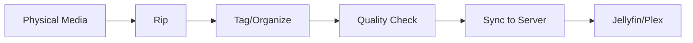

# Open Source Release Strategy & Roadmap

> **Purpose:** Transform this repository into a polished, release-ready open source project that serves as both a practical tool and portfolio showpiece.

---

## 📊 Executive Summary: Release Readiness Assessment

### Current State (February 2026)

| Area | Score | Status |
|------|-------|--------|
| **Functionality** | ⭐⭐⭐⭐⭐ | Excellent - Complete CD/DVD/Blu-ray pipelines working |
| **Documentation** | ⭐⭐⭐⭐☆ | ✅ README redesigned, QUICKSTART added |
| **Code Quality** | ⭐⭐⭐⭐☆ | Solid scripts, needs consistency and type hints |
| **Legal Clarity** | ⭐⭐⭐⭐⭐ | ✅ Complete - LICENSE, DISCLAIMER, CONTRIBUTING, etc. |
| **Visual Appeal** | ⭐⭐⭐☆☆ | Improved - README hero page, badges added |
| **Onboarding** | ⭐⭐⭐⭐☆ | ✅ QUICKSTART.md added, README redesigned |

**Verdict:** *Phase 1 complete. Legally releasable. Continuing polish for high-quality release.*

---

## 🎯 The Five Pillars of Release Readiness

### Pillar 1: Open Source Compliance ✅ COMPLETE

**Completed Items (Feb 3, 2026):**
- [x] **LICENSE file** - MIT license added
- [x] **CONTRIBUTING.md** - Contribution guidelines with style guide
- [x] **CODE_OF_CONDUCT.md** - Minimal, practical community standards
- [x] **SECURITY.md** - Vulnerability reporting process
- [x] **DISCLAIMER.md** - Comprehensive legal protections
- [ ] **Dependency licensing audit** - Verify all deps are compatible

**Recommended License:** MIT or Apache 2.0 (permissive, portfolio-friendly)

**Action Items:**
```
Priority: CRITICAL (blocks public release)
Effort: 1-2 hours
```

### Pillar 2: Documentation Quality ⚠️ NEEDS WORK

**Current Issues:**
- README.md is 826 lines (too dense, overwhelming)
- No visual diagrams of workflows
- Documentation scattered across 6+ files
- No quick-start for new users (< 5 min setup)
- No architecture overview

**Target State:**
```
docs/
├── README.md              # Hero page: What, Why, Quick Start (< 100 lines)
├── QUICKSTART.md          # 5-minute setup guide
├── architecture.md        # System diagrams (Mermaid/ASCII)
├── guides/
│   ├── cd-ripping.md
│   ├── video-ripping.md
│   ├── music-tagging.md
│   └── server-sync.md
├── reference/
│   ├── scripts.md         # All scripts with examples
│   ├── configuration.md   # All config options
│   └── api-keys.md        # External service setup
└── assets/
    ├── workflow-diagram.svg
    ├── architecture.svg
    └── screenshots/
```

**Visual Documentation Needed:**


### Pillar 3: Code Structure & Modularity ⚠️ NEEDS REFINEMENT

**Current Structure Analysis:**
```
bin/
├── music/    (18 scripts) - Some overlap, inconsistent naming
├── video/    (12 scripts) - Good organization
├── tv/       (2 scripts)  - Sparse but functional
├── sync/     (4 files)    - Well-designed
└── utils/    (2 scripts)  - Underutilized
```

**Issues Identified:**
1. **Naming inconsistency:** `fix_album.py` vs `tag-explicit-mb.py` vs `update-genre-mb.py`
2. **No shared library:** Each script reimplements common patterns
3. **Hardcoded paths:** Some scripts assume `/Volumes/Data/Media/...`
4. **Missing `__init__.py`:** Can't import between modules
5. **No entry point:** No unified CLI or `main.py`

**Proposed Refactor:**
```
digital-library/
├── mediaflow/              # Python package (new)
│   ├── __init__.py
│   ├── cli.py             # Unified CLI entry point
│   ├── core/
│   │   ├── config.py      # Centralized configuration
│   │   ├── logging.py     # Structured logging
│   │   └── api_clients.py # MusicBrainz, TMDb, etc.
│   ├── music/
│   │   ├── tagger.py
│   │   ├── ripper.py
│   │   └── organizer.py
│   ├── video/
│   │   ├── ripper.py
│   │   └── metadata.py
│   └── sync/
│       └── library.py
├── bin/                    # Thin wrappers (backward compat)
├── tests/                  # Expanded test suite
└── setup.py / pyproject.toml
```

### Pillar 4: Copyright & Legal Prudence ⚠️ CRITICAL

**Current Legal Statement (README.md line 825-826):**
> "These scripts are intended for making personal backups of media you own and for local, personal use only."

**This is insufficient for open source release.**

**Required Legal Protections:**

#### A. Clear Disclaimer (DISCLAIMER.md)
```markdown
# Legal Disclaimer

This software is provided for **personal backup purposes only**.

## Intended Use
- Creating personal backups of physical media you legally own
- Organizing and cataloging your personal media collection
- Tagging and managing metadata for your own library

## Explicit Non-Endorsement
This software does NOT:
- Circumvent copy protection (relies on tools like MakeMKV which users must license separately)
- Download copyrighted content from the internet
- Facilitate piracy or copyright infringement in any way

## User Responsibility
Users are solely responsible for:
- Ensuring compliance with local copyright laws
- Obtaining proper licenses for any decryption tools used
- Using this software only for media they legally own

## No Warranty
THIS SOFTWARE IS PROVIDED "AS IS" WITHOUT WARRANTY OF ANY KIND.
The authors are not liable for any misuse of this software.
```

#### B. API Terms Compliance Notice
```markdown
## Third-Party Services
This software interfaces with:
- **MusicBrainz** - Subject to rate limiting; respect usage policies
- **TMDb** - Requires free API key; attribution required
- **OMDb** - API key required; paid tiers for high usage
- **Spotify** - OAuth credentials required; respect ToS
- **iTunes/Apple Music** - Public API; subject to ToS

Users must obtain their own API keys and comply with each service's terms.
```

#### C. Decryption Tool Disclaimer
```markdown
## About MakeMKV and Decryption
This software does NOT include any decryption capabilities.
It invokes external tools (MakeMKV) which users must:
1. Download and install separately
2. License appropriately (MakeMKV is beta-free or requires purchase)
3. Use in accordance with their jurisdiction's laws

The authors of this software have no affiliation with MakeMKV.
```

### Pillar 5: Portfolio Presentation ⚠️ NEEDS POLISH

**Current State:** Technical documentation optimized for users, not visitors.

**Target State:** Beautiful, engaging project page that demonstrates:
- Professional software engineering practices
- Clear problem-solving ability
- Attention to detail and user experience
- Technical depth with accessible presentation

**Portfolio-Ready README Structure:**
```markdown
<div align="center">
  
  <h1>MediaFlow</h1>
  <p><strong>Physical Media → Digital Library → Streaming Server</strong></p>
  
  <p>
    <a href="#features">Features</a> •
    <a href="#quick-start">Quick Start</a> •
    <a href="#documentation">Docs</a> •
    <a href="#contributing">Contributing</a>
  </p>
  
  <p>
    
    
    
  </p>
</div>

> 🎵 **Rip CDs to FLAC** with MusicBrainz metadata and cover art  
> 📀 **Archive DVDs/Blu-rays** with proper subtitles and organization  
> 🎬 **Tag everything** with TMDb, Spotify, and iTunes metadata  
> 🔄 **Sync to Jellyfin/Plex** with content filtering (explicit, ratings)

## ✨ Why MediaFlow?

| Problem | Solution |
|---------|----------|
| CDs scattered, no organization | One command: rip, tag, organize |
| DVDs with wrong subtitles | Intelligent language detection and burn-in |
| Manual metadata entry | Automatic lookups from 5+ sources |
| Explicit content on family server | Filter by EXPLICIT tag or MPAA rating |

## 🚀 Quick Start (5 minutes)

\`\`\`bash
# Clone and setup
git clone https://github.com/yourusername/mediaflow.git
cd mediaflow
make install-deps

# Configure
cp .env.sample .env
# Edit .env with your API keys (optional but recommended)

# Rip your first CD
make rip-cd
\`\`\`

📖 **[Full Documentation →](docs/README.md)**
```

---

## 📋 Release Checklist

### Phase 1: Legal & Compliance ✅ COMPLETE
- [x] Add `LICENSE` file (MIT)
- [x] Create `DISCLAIMER.md` with legal protections
- [x] Add `CONTRIBUTING.md` with guidelines
- [x] Add `CODE_OF_CONDUCT.md` (Contributor Covenant)
- [x] Add `SECURITY.md` for vulnerability reporting
- [x] **Scan for PII** - Completed; sensitive files already gitignored
- [x] Ensure `.env.sample` has no real credentials - Verified clean

**Remaining (Low Priority):**
- [ ] Audit all dependencies for license compatibility
- [ ] Decision: Genericize `/Volumes/Data/Media` paths in docs (low risk, functional defaults)

### Phase 2: Documentation Overhaul ✅ MOSTLY COMPLETE
- [x] **Redesign README.md** as portfolio hero page (141 lines)
- [x] **Create QUICKSTART.md** (10-minute setup)
- [x] **Add badges** (Python version, license, platform)
- [x] **Add workflow diagrams** (Mermaid) - Added to `docs/workflow_overview.md`
- [x] **Create architecture overview** with diagram - System overview in workflow_overview.md

**Remaining (Nice-to-Have):**
- [ ] Reorganize docs/ into guides/ and reference/ subdirectories
- [ ] Add screenshots of terminal output (CD rip, video rip, sync)
- [ ] Create logo/branding assets
- [ ] Review all docs for outdated references or broken links

### Phase 3: Code Quality 🟡 IN PROGRESS
- [x] **Add pyproject.toml** for modern Python packaging (includes black, isort, mypy config)

**Remaining (Important for Professional Release):**
- [ ] **Script Audit** - See detailed checklist below
- [ ] **Standardize naming**: Mixed `snake_case`/`kebab-case` - decide policy for new scripts
- [ ] **Add type hints** to critical Python functions (start with public APIs)
- [ ] **Extract shared code** into `mediaflow/core/` (config, logging, API clients)
- [ ] **Add pre-commit hooks** (black, isort, flake8)
- [ ] **Create unified CLI** entry point (optional, nice-to-have)

**Deferred:**
- [ ] Improve test coverage to 80%+ (current tests work; expand later)

### Phase 4: Polish & Beauty 🟢 NICE-TO-HAVE
- [ ] Design project logo (simple, memorable)
- [ ] Create hero banner image for README
- [ ] Add GIF demo of ripping workflow
- [ ] Add terminal screenshots with output
- [ ] Test README rendering on GitHub before release

**Deferred:**
- [ ] Create consistent emoji/icon language
- [ ] Add "Made with ❤️" footer

### Phase 5: Community Readiness ✅ COMPLETE
- [x] Create issue templates (bug, feature, question) - `.github/ISSUE_TEMPLATE/`
- [x] Create PR template - `.github/pull_request_template.md`
- [x] Add GitHub Actions CI (tests, linting) - `.github/workflows/ci.yml`

**Deferred (Post-Release):**
- [ ] Set up GitHub Discussions (if community grows)
- [ ] Write announcement blog post
- [ ] HackerNews/Reddit launch post

---

## 🔧 Script Audit Checklist (Pre-Release)

> **Goal:** Ensure all scripts are useful, well-placed, non-redundant, have clear responsibilities, and support chainable workflows.

### Audit Criteria
- [ ] **Usefulness**: Each script solves a real problem; no "demo" or placeholder scripts
- [ ] **Placement**: Scripts are in the correct `bin/` subdirectory (music/, video/, sync/, utils/)
- [ ] **Non-redundancy**: No duplicate functionality across scripts; consolidate if needed
- [ ] **Clear responsibility**: Each script does ONE thing well (single responsibility)
- [ ] **Chainability**: Scripts can be composed (stdin/stdout, exit codes, consistent arg patterns)
- [ ] **Documentation**: Each script has `--help` with clear usage examples
- [ ] **Error handling**: Scripts fail gracefully with useful error messages
- [ ] **Dependency checks**: Scripts verify required tools exist before running

### Scripts to Review

#### bin/music/ (18 scripts)
| Script | Status | Notes |
|--------|--------|-------|
| `check_album_integrity.py` | [ ] Review | Core utility - keep |
| `compare_music.py` | [ ] Review | Useful for library comparison |
| `fix_album.py` | [ ] Review | Core workflow script |
| `fix_album_covers.py` | [ ] Review | Overlaps with check_album_integrity --get-covers? |
| `fix_metadata.py` | [ ] Review | Relationship to fix_album.py? |
| `fix_track.py` | [ ] Review | Single-track fixer |
| `fix-missing-metadata.py` | [ ] Review | Overlaps with other fix scripts? |
| `fix-single-title.py` | [ ] Review | Specialized - keep or archive? |
| `fix-track-numbers.py` | [ ] Review | Specialized - keep or archive? |
| `fix-unknown-album.py` | [ ] Review | Specialized - keep or archive? |
| `generate-playlists.py` | [ ] Review | Useful utility |
| `repair-flac-tags.py` | [ ] Review | Tag repair from m3u |
| `set_explicit.py` | [ ] Review | Overlaps with tag-explicit-mb.py? |
| `tag-explicit-mb.py` | [ ] Review | Core explicit tagger |
| `tag-manual-genre.py` | [ ] Review | Manual genre assignment |
| `update-from-m3u.py` | [ ] Review | Updates tags from playlist |
| `update-genre-mb.py` | [ ] Review | MusicBrainz genre updater |

#### bin/video/ (12 scripts)
| Script | Status | Notes |
|--------|--------|-------|
| `backfill_subs.py` | [ ] Review | Subtitle muxing |
| `embed_thumbnail.py` | [ ] Review | Thumbnail embedding |
| `fix_music_videos.py` | [ ] Review | Generic organizer |
| `fix_music_videos_mapped.py` | [ ] Review | With hardcoded mappings |
| `fix_music_videos_secondary.py` | [ ] Review | Secondary collection |
| `rip_video.py` | [ ] Review | Core ripping script |
| `scan_music_video_metadata.py` | [ ] Review | Metadata scanner |
| `set-movie-imdb-override.py` | [ ] Review | Override helper |
| `standardize_music_video_filenames.py` | [ ] Review | Filename standardizer |
| `tag-movie-metadata.py` | [ ] Review | Movie metadata tagger |
| `tag-movie-ratings.py` | [ ] Review | MPAA rating tagger |
| `vobsub_to_srt.py` | [ ] Review | Subtitle converter |

#### bin/sync/ (4 files)
| Script | Status | Notes |
|--------|--------|-------|
| `master-sync.py` | [ ] Review | Orchestration script |
| `sync-library.py` | [ ] Review | Core sync with filtering |
| `sync-config.yaml.example` | [ ] Review | Example config |

#### bin/tv/ (2 scripts)
| Script | Status | Notes |
|--------|--------|-------|
| `rename_shows_jellyfin.py` | [ ] Review | Show renamer |
| `tag-show-metadata.py` | [ ] Review | TV metadata tagger |

#### bin/utils/ (2 scripts)
| Script | Status | Notes |
|--------|--------|-------|
| `convert_playlists.py` | [ ] Review | Playlist format converter |
| `m3u_to_m3u8.sh` | [ ] Review | Simple m3u converter |

### Archive Candidates (`_archive/`)
Scripts that may be deprecated, redundant, or superseded:
- [ ] Review `_archive/` contents for anything worth rescuing
- [ ] Ensure archived scripts are clearly marked as unsupported

---

## 🏗️ Architecture Overview (Reference)

```
┌─────────────────────────────────────────────────────────────────┐
│                        MEDIAFLOW SYSTEM                          │
├─────────────────────────────────────────────────────────────────┤
│                                                                  │
│  ┌──────────┐   ┌──────────┐   ┌──────────┐   ┌──────────┐     │
│  │   CDs    │   │   DVDs   │   │ Blu-rays │   │  Files   │     │
│  └────┬─────┘   └────┬─────┘   └────┬─────┘   └────┬─────┘     │
│       │              │              │              │            │
│       ▼              ▼              ▼              ▼            │
│  ┌─────────────────────────────────────────────────────────┐   │
│  │                    INPUT LAYER                           │   │
│  │  abcde (CD)  │  MakeMKV (Video)  │  File Scanner        │   │
│  └─────────────────────────────────────────────────────────┘   │
│                              │                                  │
│                              ▼                                  │
│  ┌─────────────────────────────────────────────────────────┐   │
│  │                  PROCESSING LAYER                        │   │
│  │  ┌─────────┐  ┌─────────┐  ┌─────────┐  ┌─────────┐    │   │
│  │  │ Encoder │  │ Tagger  │  │Organizer│  │ Checker │    │   │
│  │  │HandBrake│  │MusicBrnz│  │ Rename  │  │ Quality │    │   │
│  │  └─────────┘  └─────────┘  └─────────┘  └─────────┘    │   │
│  └─────────────────────────────────────────────────────────┘   │
│                              │                                  │
│                              ▼                                  │
│  ┌─────────────────────────────────────────────────────────┐   │
│  │                   METADATA LAYER                         │   │
│  │  MusicBrainz │ TMDb │ OMDb │ Spotify │ iTunes │ Overrides│  │
│  └─────────────────────────────────────────────────────────┘   │
│                              │                                  │
│                              ▼                                  │
│  ┌─────────────────────────────────────────────────────────┐   │
│  │                    OUTPUT LAYER                          │   │
│  │  ┌─────────────────┐      ┌─────────────────┐           │   │
│  │  │  Local Library  │──────│   Sync Engine   │           │   │
│  │  │  /Media/Library │      │  rsync + filter │           │   │
│  │  └─────────────────┘      └────────┬────────┘           │   │
│  │                                    │                     │   │
│  │                                    ▼                     │   │
│  │                         ┌─────────────────┐             │   │
│  │                         │  Media Server   │             │   │
│  │                         │ Jellyfin/Plex   │             │   │
│  │                         └─────────────────┘             │   │
│  └─────────────────────────────────────────────────────────┘   │
│                                                                  │
└─────────────────────────────────────────────────────────────────┘
```

---

## 🎨 Branding Direction

### Project Name Options
| Name | Pros | Cons |
|------|------|------|
| **MediaFlow** | Clear, professional, implies pipeline | Generic |
| **DiscVault** | Physical media focus, archival feel | Narrow scope |
| **RipStation** | Action-oriented, memorable | Sounds amateur |
| **Archivista** | Sophisticated, library-like | Hard to spell |
| **PhysicalDigital** | Descriptive | Too long |

**Recommendation:** `MediaFlow` - professional, memorable, domain-available

### Visual Identity
- **Colors:** Deep blue (#1a365d) + warm orange (#ed8936) accent
- **Logo:** Stylized disc transforming into streaming waves
- **Font:** Inter or JetBrains Mono (for code)
- **Tone:** Professional but approachable, technical but accessible

---

## 📅 Timeline

| Week | Focus | Deliverables |
|------|-------|--------------|
| 1 | Legal + Docs Start | LICENSE, DISCLAIMER, New README draft |
| 2 | Docs Complete | QUICKSTART, diagrams, reorganized docs/ |
| 3 | Code Quality | Naming consistency, type hints, tests |
| 4 | Polish + Launch | Logo, screenshots, CI, soft launch |

**Target Release Date:** March 2026 (v1.0.0)

---

## ⚠️ Risk Register

| Risk | Impact | Mitigation |
|------|--------|------------|
| Legal challenge re: decryption | High | Clear disclaimers, no decryption code included |
| API ToS violation | Medium | Document compliance, use rate limiting |
| macOS-only limits adoption | Medium | Document Linux/Windows status, accept PRs |
| Overwhelming scope | High | Focus on core workflows, defer nice-to-haves |

---

## 📈 Success Metrics

### Technical
- [ ] 80%+ test coverage
- [ ] Zero linting errors
- [ ] All scripts work without modification after clone
- [ ] CI passing on all commits

### Documentation
- [ ] New user can rip first CD in < 10 minutes
- [ ] All workflows have copy-pasteable examples
- [ ] Architecture is understood from single diagram

### Community
- [ ] 50+ GitHub stars in first month
- [ ] 5+ external contributors in first year
- [ ] Featured in "awesome" lists or media server forums

### Portfolio
- [ ] README renders beautifully on GitHub
- [ ] Project demonstrates professional engineering
- [ ] Can confidently share in job interviews

---

*Last Updated: February 3, 2026*

*Status: Planning Phase - Legal compliance is blocking release*

*Next Action: Create LICENSE and DISCLAIMER.md files*
