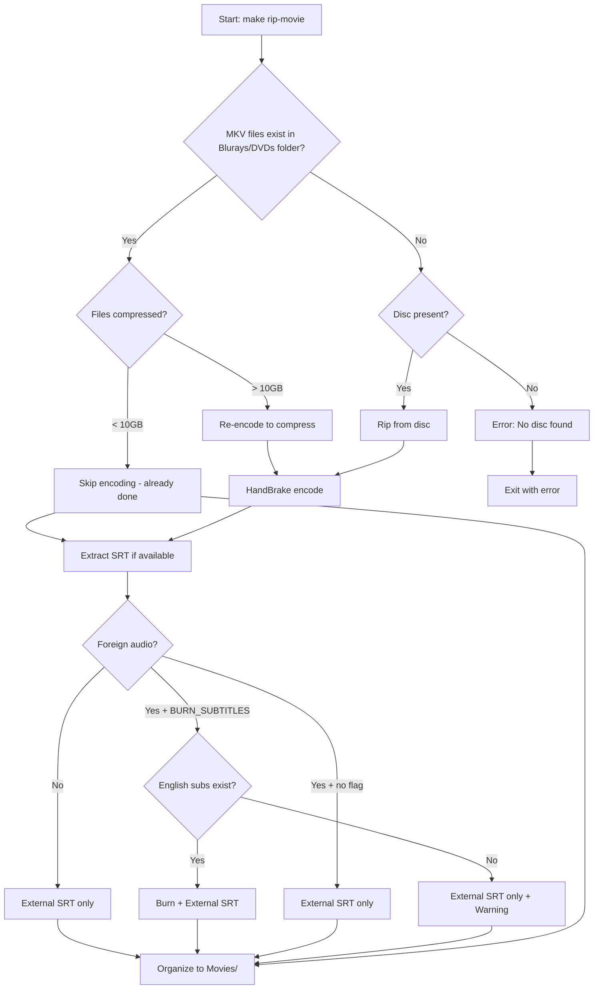
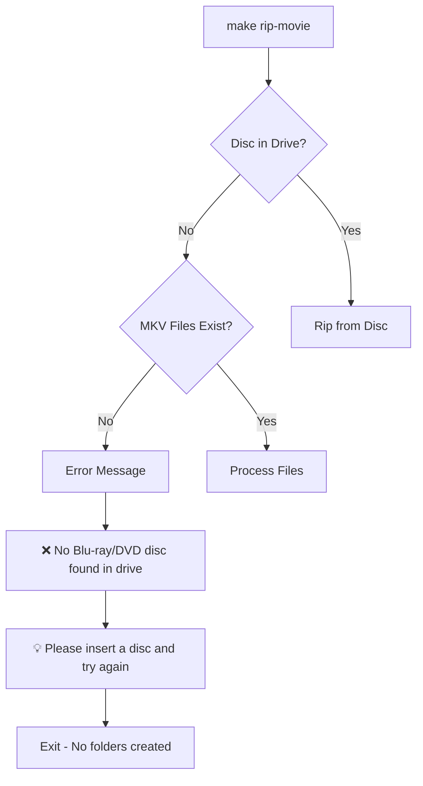
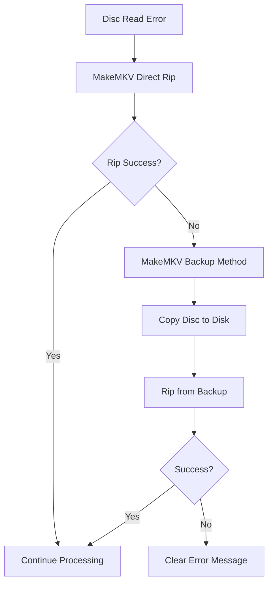

# Video Processing Workflows

Complete guide to all video processing scenarios and workflows in the digital library system.

> **Updated:** February 2026 - Unified MP4 + External SRT approach for all content

---

## 🎬 Quick Reference

| Scenario | Command | Output | Subtitles |
|----------|---------|--------|-----------|
| **English DVD/Blu-ray** | `make rip-movie TITLE="Film" YEAR=2023 TYPE=bluray` | MP4 + SRT | External SRT |
| **Foreign Film** | `BURN_SUBTITLES=true make rip-movie TITLE="Film" YEAR=2023 TYPE=bluray` | MP4 (burned) + SRT | Burned + External |
| **Existing MKV** | `make rip-movie TITLE="Film" YEAR=2023 TYPE=bluray` | MP4 + SRT | External SRT |
| **Large MKV** | `make rip-movie TITLE="Film" YEAR=2023 TYPE=bluray` | Compressed MP4 + SRT | External SRT |

---

## 📊 Scenario Matrix

| Scenario | Input | Output | Subtitles | Container | Use Case |
|----------|-------|--------|-----------|-----------|----------|
| **English DVD** | DVD disc | MP4 + SRT | External SRT | MP4 | English DVDs |
| **English Blu-ray** | Blu-ray disc | MP4 + SRT | External SRT | MP4 | English Blu-rays |
| **Foreign DVD** | DVD disc | MP4 (burned) + SRT | Burned + External | MP4 | Foreign DVDs |
| **Foreign Blu-ray** | Blu-ray disc | MP4 (burned) + SRT | Burned + External | MP4 | Foreign Blu-rays |
| **Existing MKV** | MKV file | MP4 + SRT | External SRT | MP4 | Already ripped |
| **Large MKV** | Uncompressed MKV | Compressed MP4 + SRT | External SRT | MP4 | Re-compression needed |

---

## 🔄 Detailed Workflows

### 1. English Film Processing

```mermaid
graph TD
    A[Start: make rip-movie] --> B{MKV files exist in Blurays/DVDs folder?}
    B -->|Yes| C[Process existing MKV]
    B -->|No| D[Scan disc for main feature]
    D --> E[Analyze streams from disc]
    E --> F{English audio + English soft subs?}
    F -->|Yes| G[Auto-extract SRT - no prompt]
    F -->|No| H[Interactive prompt before rip]
    G --> I[Rip main feature to MKV]
    H --> I
    I --> J[HandBrake Encode]
    C --> J
    J --> K[MP4 File ~2-3GB]
    K --> L[Organize to Movies/]
    L --> M[Movies/Title (Year)/]
    M --> N[Title (Year).mp4]
    M --> O[Title (Year).en.srt if available]
```

**Command:**
```bash
make rip-movie TITLE="The Goonies" YEAR=1985 TYPE=bluray
```

**Expected Output (Simple case - auto-skip prompt):**
```
No MKV files found, ripping from disc...
  ✓ Detected BLURAY disc
Scanning for main feature (longest track)...
Found 4 titles with similar duration, checking sizes...
Selected largest title: 1 (23.8 GB)
Found main feature: Title 1 (1:53:55)
Skipping 8 shorter tracks

🎬 Detected: English movie with English audio and soft subtitles
  → Will automatically extract English soft subtitles to .srt file
==================================================
  → Running: makemkvcon mkv disc:0 1 /Users/martin/Movies/Rips/Blurays/The Goonies (1985)
```

**Expected Output (Complex case - shows prompt):**
```
No MKV files found, ripping from disc...
  ✓ Detected BLURAY disc
Scanning for main feature (longest track)...
Found 4 titles with similar duration, checking sizes...
Selected largest title: 1 (23.8 GB)
Found main feature: Title 1 (1:53:55)
Skipping 8 shorter tracks

🎬 Disc Analysis (Main Feature)
==================================================
🎵 Audio Tracks: 3
   Track 0: ENG (dts)
   Track 1: ENG (ac3)
   Track 2: FRE (ac3)

📝 Subtitle Tracks: 2
   Track 0: ENG (hdmv_pgs_subtitle)
   Track 1: FRE (hdmv_pgs_subtitle)

🎯 Recommended Action: standard_mp4
==================================================
Available Options:
👉 1) Standard MP4 (no subtitle processing)
   2) Burn image subtitles into video (hard subtitles)
   3) Convert image subtitles to text file with OCR (future feature)
   4) Skip all subtitle processing

Select option [1-4, default=standard_mp4]: 
```

**Final Organization:**
```
/Users/martin/Movies/Rips/
├── Blurays/The Goonies (1985)/          # Source folder
│   └── The Goonies (1985).mkv           # Original (18.4GB)
└── Movies/The Goonies (1985)/           # Destination folder
    ├── The Goonies (1985).mp4           # Compressed (2.3GB)
    └── The Goonies (1985).en.srt        # External subs (if available)
```

### 2. Foreign Film Processing

```mermaid
graph TD
    A[Start: make rip-movie] --> B{MKV files exist in Blurays/DVDs folder?}
    B -->|Yes| C[Process existing MKV]
    B -->|No| D[Scan disc for main feature]
    D --> E[Analyze streams from disc]
    E --> F{English audio present?}
    F -->|No| G[Suggest burn_pgs_subs / burn_subs]
    F -->|Yes| H[Suggest standard_mp4]
    G --> I[Interactive prompt before rip]
    H --> I
    I --> J[Rip main feature to MKV]
    J --> K[HandBrake + Apply Subtitle Choice]
    C --> K
    K --> L[Organize to Movies/]
    L --> M[Movies/Title (Year)/]
    M --> N[Title (Year).mp4]
    M --> O[Title (Year).en.srt if extracted]
```

**Command:**
```bash
make rip-movie TITLE="Amélie" YEAR=2001 TYPE=bluray
```

**Expected Output (No English audio - suggests burn):**
```
No MKV files found, ripping from disc...
  ✓ Detected BLURAY disc
Scanning for main feature (longest track)...

🎬 Disc Analysis (Main Feature)
==================================================
🎵 Audio Tracks: 1
   Track 0: FRE (ac3)

📝 Subtitle Tracks: 1
   Track 0: ENG (hdmv_pgs_subtitle)

🎯 Recommended Action: burn_pgs_subs
==================================================
Available Options:
   1) Standard MP4 (no subtitle processing)
👉 2) Burn image subtitles into video (hard subtitles)
   3) Convert image subtitles to text file with OCR (future feature)
   4) Skip all subtitle processing

Select option [1-4, default=burn_pgs_subs]: 2
✓ Selected action: burn_pgs_subs
==================================================
  → Running: makemkvcon mkv disc:0 1 /Users/martin/Movies/Rips/Blurays/Amélie (2001)
```

### 3. Existing File Processing

```mermaid
graph TD
    A[Start: make rip-movie] --> B{MKV files exist in Blurays/DVDs folder?}
    B -->|Yes| C{File Size Check}
    B -->|No| D[Rip from disc]
    D --> E[Create MKV files]
    E --> C
    C -->|< 10GB| F[Already Compressed - Skip]
    C -->|> 10GB| G[Re-encode Needed]
    G --> H[HandBrake Encode]
    H --> I[Compressed MP4]
    F --> J[Extract SRT if available]
    I --> J
    J --> K[Organize to Movies/]
    K --> L[Movies/Title (Year)/]
    L --> M[Title (Year).mp4]
    L --> N[Title (Year).en.srt if available]
```

**Command:**
```bash
make rip-movie TITLE="Silent Running" YEAR=1972 TYPE=bluray
```

**Expected Output (large file):**
```
Found 1 existing MKV files, skipping disc rip...
⚠️  Found large file (21.1GB) - re-encoding to compress...
→ Using temporary output: Silent Running (1972)_compressed.mp4
→ Encoding to MP4...
✓ Encoding complete: Silent Running (1972)_compressed.mp4
✓ Extracted 1 subtitle file(s)
✓ Streaming optimization applied
Done: /Users/martin/Movies/Rips/Movies/Silent Running (1972)
```

---

## 🎯 Master Decision Tree



---

## 🚨 Error Handling Workflows

### No Disc + No Files



### Problematic Disc



---

## 📁 File Organization Patterns

### ✅ Correct Success Pattern: English Film
```
/Users/martin/Movies/Rips/
├── Blurays/The Goonies (1985)/          # Source folder (MKV only)
│   └── The Goonies (1985).mkv           # Original rip (20GB)
└── Movies/The Goonies (1985)/           # Destination folder (MP4 + SRT only)
    ├── The Goonies (1985).mp4           # Compressed (2GB)
    └── The Goonies (1985).en.srt        # External subs (if available)
```

### ✅ Correct Success Pattern: Foreign Film
```
/Users/martin/Movies/Rips/
├── Blurays/Amélie (2001)/               # Source folder (MKV only)
│   └── Amélie (2001).mkv                # Original rip (15GB)
└── Movies/Amélie (2001)/                # Destination folder (MP4 + SRT only)
    ├── Amélie (2001).mp4                # Compressed + burned subs (2GB)
    └── Amélie (2001).en.srt             # External subs backup
```

### ✅ Error Pattern: No Disc
```
/Users/martin/Movies/Rips/
├── Blurays/                             # No empty folders created
└── Movies/                              # No empty folders created
```

---

## 📂 Folder Structure Rules

### 🎯 **Source Folders (Blurays/DVDs)**
- **Purpose:** Store original MKV rips from discs
- **Files:** Only `.mkv` files
- **Location:** `/Blurays/Title (Year)/` or `/DVDs/Title (Year)/`
- **Size:** Large uncompressed files (10-50GB)

### 🎯 **Destination Folders (Movies)**
- **Purpose:** Store final processed media
- **Files:** Only `.mp4` and `.en.srt` files
- **Location:** `/Movies/Title (Year)/`
- **Size:** Compressed MP4 (1-3GB) + small SRT files

### � **Folder Guidelines:**
- **Source folders:** Store only MKV files from disc rips
- **Destination folders:** Store only MP4 and SRT files for final media
- **Keep original files:** Preserve MKV files in source folders
- **Final output:** Create MP4 files in destination folders

### 🔄 **Workflow:**
```
Blurays/DVDs (Source) → Processing → Movies (Destination)
     MKV files                           MP4 + SRT files
```

---

## 🎛️ Control Variables

| Variable | Values | Effect |
|----------|--------|--------|
| `TYPE` | `dvd` | `bluray` | Disc type detection |
| `BURN_SUBTITLES` | `true` | `false` (default) | Burn subs for foreign films |
| `FORCE_ALL_TRACKS` | `true` | `false` (default) | Rip all titles vs main feature |
| `STREAMING_OPTIMIZE` | `true` (default) | `false` | Apply web optimization |

---

## 🎬 Key Features & Benefits

### ✅ Universal Compatibility
- **MP4 format** works on all devices and players
- **External SRT** files auto-detected by Jellyfin
- **Web streaming** optimized for all clients

### ✅ Intelligent Processing
- **Smart compression** - only re-encode when necessary
- **Foreign film support** - burns subtitles when available
- **Error resilience** - graceful handling of missing discs

### ✅ Jellyfin Integration
- **Automatic subtitle detection** - `.en.srt` files found automatically
- **Proper metadata** - titles and years organized correctly
- **Streaming ready** - optimized for web playback

### ✅ User Control
- **Explicit subtitle burning** - only when `BURN_SUBTITLES=true`
- **Flexible workflows** - works with existing files or fresh rips
- **Clear messaging** - tells user exactly what's happening

---

## 🚀 Quick Start Examples

### Basic English Film
```bash
make rip-movie TITLE="The Goonies" YEAR=1985 TYPE=bluray
```

### Foreign Film with Subtitle Burning
```bash
BURN_SUBTITLES=true make rip-movie TITLE="Amélie" YEAR=2001 TYPE=bluray
```

### Process All Tracks (Special Features)
```bash
FORCE_ALL_TRACKS=true make rip-movie TITLE="Special Film" YEAR=2023 TYPE=dvd
```

### Disable Streaming Optimization
```bash
STREAMING_OPTIMIZE=false make rip-movie TITLE="Film" YEAR=2023 TYPE=bluray
```

---

## 📞 Troubleshooting

### Common Issues
- **"No disc found"** - Insert disc or check MKV files in correct location
- **"Silent HandBrake failure"** - Check file permissions and disk space
- **"No subtitles extracted"** - Source may not have English subtitle tracks
- **"File too large"** - Script will automatically re-compress files >10GB

### Getting Help
- Check the log output for specific error messages
- Ensure all prerequisites are installed: `make install-video-deps`
- Verify MakeMKV is properly installed in `/Applications/`

This unified approach handles all your video processing needs with maximum compatibility and user control! 🎬✨
