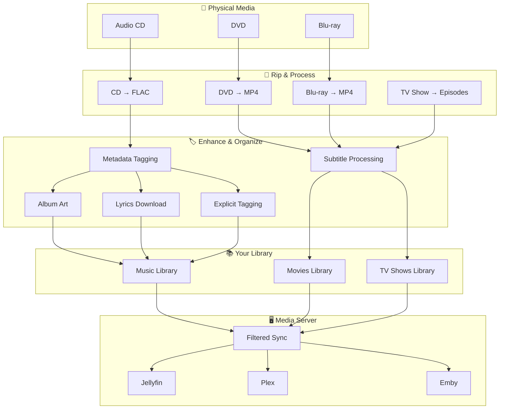

# Workflow Guide

Complete overview of Digital Archive Maker workflows from physical media to organized digital library.

---

## 🎯 Core Workflows

Digital Archive Maker provides unified workflows for three main content types:

- **🎵 Audio CDs → Digital music library with metadata**
- **🎬 Movie discs → High-quality video with subtitles**
- **📺 TV shows → Complete episode collections**

Each workflow uses the simple `dam` command with consistent patterns.

---

## 🏛️ Archive Locally, Share Selectively

### **Stage 1: Your Perfect Local Archive**
Your **LIBRARY_ROOT** becomes your complete digital collection:
- **Everything preserved**: No content filtering - keep all your media in high quality
- **Rich metadata**: Automatic tagging from MusicBrainz, TMDb, Spotify, and more
- **Perfect organization**: Files organized by artist, album, movie, TV show
- **Your master copy**: The single source of truth for your entire collection

### **Stage 2: Filtered Server Sync**
**`dam sync`** prepares content for your media server:
- **Smart filtering**: Skip explicit content, unknown ratings, or files you choose
- **Family-friendly options**: Different rules for different audiences
- **Multiple destinations**: Sync to Jellyfin, Plex, or backup drives
- **Your choice**: What gets shared is up to you

### **How It Works**
```
Physical Media → [RIP + TAG + ORGANIZE] → Your Complete Library
                                      ↓
                                  [SYNC + FILTERS]
                                      ↓
                               Media Server (selective)
```

**Result**: Keep everything perfect locally, share only what you want with your media server.

---

## 🌊 Workflow Overview



---

## 🎵 Music Workflow

### **Complete Pipeline**
```
Audio CD → abcde → FLAC files → Metadata → Lyrics → Library → Server
```

### **Step-by-Step**

#### **1. Rip CD**
```bash
# Insert CD and rip
make rip-cd
dam rip cd
```

**Output**: `${LIBRARY_ROOT}/CDs/Artist/Album/NN - Title.flac`

#### **2. Enhance Metadata**
```bash
# Fix album covers
dam fix-covers ${LIBRARY_ROOT}/CDs

# Add lyrics
dam tag lyrics ${LIBRARY_ROOT}/CDs

# Tag explicit content
dam tag explicit ${LIBRARY_ROOT}/CDs

# Add genres
dam tag genres ${LIBRARY_ROOT}/CDs
```

#### **3. Organize & Sync**
```bash
# Sync to media server
dam sync --include-music

# Preview sync
dam sync --dry-run --include-music
```

### **Quick Commands**
```bash
# Complete CD processing
make rip-cd && make process-cds

# Batch process existing music
dam tag explicit ${LIBRARY_ROOT}/Music
dam fix-covers ${LIBRARY_ROOT}/Music
dam tag lyrics ${LIBRARY_ROOT}/Music
```

---

## 🎬 Movie Workflow

### **Complete Pipeline**
```
Movie Disc → MakeMKV → HandBrake → MP4 + SRT → Library → Server
```

### **Step-by-Step**

#### **1. Rip Movie**
```bash
# Interactive rip
dam rip video

# With metadata
dam rip video --title "Movie Name" --year 2023

# Makefile shortcut
make rip-movie TITLE="Movie Name" YEAR=2023
```

**Output**: `${LIBRARY_ROOT}/Movies/Movie Name (Year)/Movie Name (Year).mp4`

#### **2. Subtitle Processing**
- **Automatic**: English movies get external SRT files
- **Foreign films**: Option to burn subtitles or extract externally
- **Interactive**: Choose subtitle processing method

#### **3. Organize & Sync**
```bash
# Sync to media server
dam sync --include-movies

# Preview sync
dam sync --dry-run --include-movies
```

### **Quick Commands**
```bash
# Foreign language film
BURN_SUBTITLES=true make rip-movie TITLE="Foreign Film" YEAR=2023

# Specific title (seamless branching)
TITLE_INDEX=2 make rip-movie TITLE="Movie" YEAR=2023
```

---

## 📺 TV Show Workflow

### **Complete Pipeline**
```
TV Disc → Track Detection → Individual Rips → MP4 + SRT → Episodes → Server
```

### **Step-by-Step**

#### **1. Rip TV Show Episodes**
```bash
# Rip all episodes
dam rip video --title "Show Name" --year 2023 --episodes

# Makefile shortcut
make rip-episodes TITLE="Show Name" YEAR=2023
```

**Output**: `${LIBRARY_ROOT}/Shows/Show Name (Year)/Season X/Show Name (Year) - S01E01.mp4`

#### **2. Episode Processing**
- **Track detection**: Finds all episode tracks on disc
- **Individual ripping**: Rips each episode separately
- **Continuous numbering**: Maintains episode order across discs
- **Subtitle extraction**: External SRT files for each episode

#### **3. Multi-Disc Series**
```bash
# Disc 1
make rip-episodes TITLE="Series Season 1" YEAR=2023

# Disc 2 (numbering continues automatically)
make rip-episodes TITLE="Series Season 1" YEAR=2023
```

#### **4. Organize & Sync**
```bash
# Sync to media server
dam sync --include-shows

# Preview sync
dam sync --dry-run --include-shows
```

---

## 🔄 Sync Workflow

### **Filtering Options**
```bash
# Family-friendly sync
dam sync --family-friendly

# Include explicit content
dam sync --include-explicit

# Specific content types
dam sync --include-music
dam sync --include-movies
dam sync --include-shows

# Multiple destinations
dam sync --destinations "/server1,/server2"
```

### **Sync Configuration**
```bash
# Environment variables
SYNC_DESTINATIONS="/path/to/server"
EXPLICIT_CONTENT_FILTER=true
SYNC_DELETE=false
SYNC_COPY=true
```

### **Preview & Verify**
```bash
# Preview changes
dam sync --dry-run

# Quiet operation
dam sync --quiet

# Verbose output
dam sync --verbose
```

---

## 🛠️ Advanced Workflows

### **Batch Processing**
```bash
# Process entire CD collection
for disc in /dev/cd*; do
    eject $disc
    # Insert next disc
    make rip-cd
done

# Process all CDs
make process-cds

# Sync everything
dam sync
```

### **Quality Control**
```bash
# Check for missing metadata
find ${LIBRARY_ROOT} -name "*.flac" -exec metaflac --show-tag=TITLE {} \;

# Verify cover art
find ${LIBRARY_ROOT} -name "cover.jpg" | wc -l

# Check lyrics files
find ${LIBRARY_ROOT} -name "*.lrc" | wc -l
```

### **Maintenance**
```bash
# Check system status
dam check

# Clean temporary files
find ${LIBRARY_ROOT} -name "*.tmp" -delete
find ${LIBRARY_ROOT} -name "*.log" -delete

# Verify library structure
tree ${LIBRARY_ROOT} -L 3
```

---

## 📊 Library Structure

### **Final Organization**
```
${LIBRARY_ROOT}/
├── CDs/                    # CD rips
│   ├── Artist/
│   │   └── Album/
│   │       ├── 01 - Track.flac
│   │       ├── 01 - Track.lrc
│   │       └── cover.jpg
├── Music/                  # Digital music
│   ├── Artist/
│   │   └── Album/
│   │       ├── 01 - Track.mp3
│   │       └── cover.jpg
├── Movies/                 # Movies
│   └── Movie (Year)/
│       ├── Movie (Year).mp4
│       ├── Movie (Year).srt
│       └── Movie (Year).nfo
├── Shows/                  # TV shows
│   └── Show (Year)/
│       └── Season X/
│           ├── Show (Year) - S01E01.mp4
│           └── Show (Year) - S01E01.srt
├── DVDs/                   # DVD backups
└── Blurays/                # Blu-ray backups
```

---

## 🎯 Best Practices

### **Before Ripping**
1. **Clean media**: Wipe discs to avoid read errors
2. **Check space**: Ensure 2-3x disc size available
3. **Verify tools**: Run `dam check` to confirm setup
4. **Configure preferences**: Set language options in `.env`

### **During Processing**
1. **Monitor output**: Watch for error messages
2. **Be patient**: High-quality processing takes time
3. **Use previews**: `--dry-run` for sync operations
4. **Batch when possible**: Process multiple items together

### **After Processing**
1. **Verify results**: Check file structure and metadata
2. **Test playback**: Verify files play correctly
3. **Sync carefully**: Use `--dry-run` before live sync
4. **Backup regularly**: Protect your digital collection

---

## 📚 Related Guides

- **[Video Guide](video_guide.md)** - Detailed movie and TV show workflows
- **[Music Guide](music_guide.md)** - Complete audio CD and file processing
- **[Server Guide](server_guide.md)** - Media server setup and configuration
- **[Quick Start](../QUICKSTART.md)** - Initial setup and installation

---

## 🤝 Contributing

Help improve workflows? Please:
1. Try the workflows and document issues
2. Suggest improvements to command patterns
3. Share your use cases and examples
4. Contribute to documentation

---

**Happy archiving!** 📚✨
