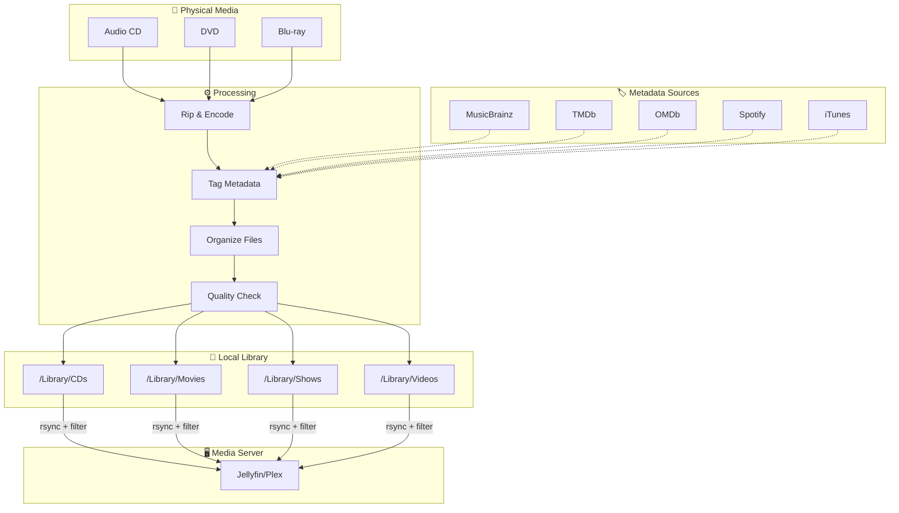
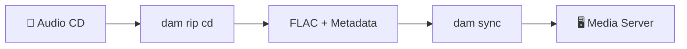
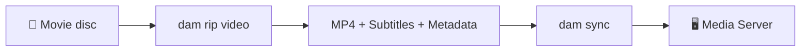

# Physical Media → Digital Archive workflow

Digital Archive Maker provides a simple command-line tool (`dam`) for two main workflows:

- **🎵 Audio CDs → FLAC library → tagging → sync to media server (optional)**
- **🎬 Movie discs → MP4 library → subtitles/organization → sync to media server (optional)**

Each step uses the simple `dam` command.

---

## 🏛️ Archive Locally, Share Selectively

### Stage 1: Your Perfect Local Archive
Your **LIBRARY_ROOT** becomes your complete digital collection:
- **Everything preserved**: No content filtering - keep all your media in high quality
- **Rich metadata**: Automatic tagging from MusicBrainz, TMDb, Spotify, and more
- **Perfect organization**: Files organized by artist, album, movie, TV show
- **Your master copy**: The single source of truth for your entire collection

### Stage 2: Filtered Server Sync
**`dam sync`** prepares content for your media server:
- **Smart filtering**: Skip explicit content, unknown ratings, or files you choose
- **Family-friendly options**: Different rules for different audiences
- **Multiple destinations**: Sync to Jellyfin, Plex, or backup drives
- **Your choice**: What gets shared is up to you

### How It Works
```
Physical Media → [RIP + TAG] → Your Complete Library
                                   ↓
                               [SYNC + FILTERS]
                                   ↓
                            Media Server (selective)
```

**Result**: Keep everything perfect locally, share only what you want with your media server.

---

## System Overview



---

## Workflow A: CDs → FLACs → sync



### A1) Rip CD to digital library
- **Command**: `dam rip cd`
- **What it does**: 
  - Rips audio CD to high-quality FLAC files
  - Automatically fetches album art and metadata from MusicBrainz
  - Creates playlist and organizes files by artist/album
- **Output**: `${LIBRARY_ROOT}/CDs/Artist/Album/NN - Title.flac`

### A2) Sync to media server (optional)
- **Command**: `dam sync`
- **What it does**: 
  - Syncs your music library to Jellyfin/Plex
  - Applies rating and explicit content filters (if set in config)
  - Maintains perfect organization on your media server

**Setup required**: Run `dam config` first to set up your library path and API keys

---

## Workflow B: Movie discs → MP4s → sync



### B1) Rip movie disc to digital library
- **Command**: `dam rip video`
- **What it does**:
  - Scans disc and shows interactive subtitle options
  - Rips DVD/Blu-ray to high-quality MP4 files
  - Automatically fetches movie metadata and ratings from TMDb
  - Handles both MakeMKV and HandBrake as needed
- **Output**: Organized MP4 files with optional subtitles and rich metadata

### B2) Sync to media server (optional)
- **Command**: `dam sync`
- **What it does**:
  - Syncs your movie library to Jellyfin/Plex
  - Applies rating and explicit content filters (if set in config)
  - Maintains perfect server-ready organization

**Setup required**: Run `dam config` first to set up your library path and API keys

---

## 📚 Additional Tools

For advanced users and special cases, see **`docs/additional_tools.md`** for:
- Manual organization scripts
- Enhanced metadata tools
- TV show processing utilities
- Custom sync options

These scripts provide additional functionality beyond the core `dam` workflows.

