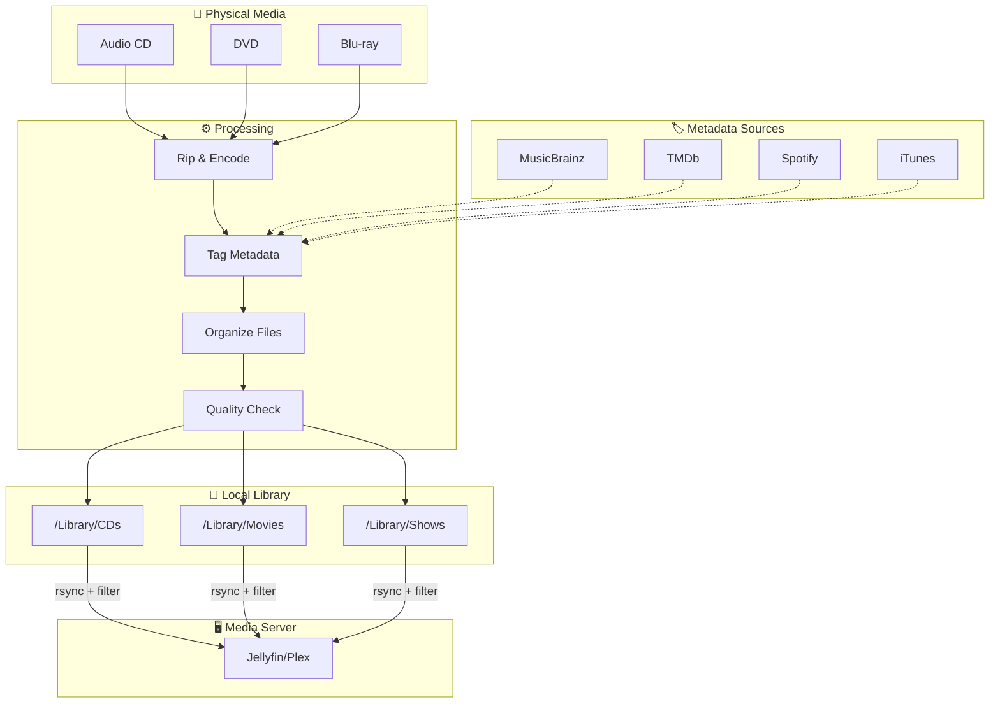
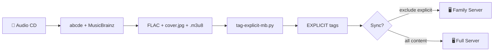
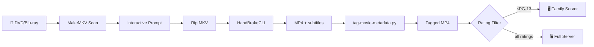

# Workflow Overview (Disc → Digital Archive)

This repository is organized around three primary workflows:

- **Audio CDs → FLAC library → tagging → optional sync to a server**
- **DVD/Blu-ray → MP4 library → subtitles/organization → server-ready layout**
- **Music Videos → organize → standardize → sync with other video content**

Each step links to the detailed guide or script.

📖 **For the complete music pipeline from ALL sources to Jellyfin, see `docs/music_collection_guide.md`**

---

## System Overview

---

## Workflow A: CDs → FLACs → tagging → sync

### A1) Rip CD to FLAC (MusicBrainz + cover + playlist)
- Guide: `docs/cd_ripping_guide.md`
- Typical command:
  - `make rip-cd`

Output (default):
- `${LIBRARY_ROOT}/CDs/Artist/Album/NN - Title.flac`
- `cover.jpg`
- `Album.m3u8`

### A2) Normalize/fix an existing album folder (optional)
- Helper: `bin/music/fix_album.py`
  - Renames tracks to `NN - Title.flac`
  - Rebuilds playlist
  - Fixes tags and cover art

### A3) Tag explicit content (per-track)
- Script: `bin/music/tag-explicit-mb.py`
- Writes per-track tag: `EXPLICIT=Yes|No|Unknown`

Debug options:
- `EXPLICIT_DRY_RUN=1` (no writes)
- `EXPLICIT_MAX_TRACKS=500` (limit scanning)

Artifacts:
- `./log/explicit/explicit_tagging_run.log` - Tracks processed during this run
- `./log/explicit/explicit_tracks_current.csv` - **Definitive list of ALL EXPLICIT=Yes tracks**
- `./log/explicit/explicit_tagging_cache.json` - Performance cache
- `./log/explicit/explicit_tagging_errors.log` - API errors only
- `./log/explicit/Explicit.m3u8` (playlist of tracks tagged `EXPLICIT=Yes`, if enabled)

### A4) Sync to a destination server while excluding explicit/unknown (optional)
- Script: `bin/sync/sync-library.py`
- Excludes are driven by the `EXPLICIT` tag:
  - `--exclude-explicit` skips `EXPLICIT=Yes`
  - `--exclude-unknown` skips `EXPLICIT=Unknown` and missing tags

---

## Workflow B: DVD/Blu-ray → MP4s → organize/subtitles → server

### B1) Rip discs to staging (MKV/MP4)
- Guide: `docs/video_ripping_guide.md`
- Commands:
  - `make rip-video` (staging)
  - `make rip-movie TITLE="Movie Name" YEAR=1999` (organize main feature)
- Features: Automatic disc scanning, interactive subtitle processing prompt before ripping, automatic compression for large MKVs.

### B2) Organize into a server-friendly layout
- Guide: `docs/media_server_setup.md`
- Recommended:
  - Movies: `.../Movies/Movie Name (Year)/Movie Name (Year).mp4`
  - TV: `.../TV/Show Name/Season 01/Show Name - S01E01 - Episode Title.mp4`

### B3) Ensure subtitles are present (optional)
- Video guide covers:
  - English subtitle selection/burn-in policies
  - Backfilling English soft subs into existing MP4s

### B4) Tag movie metadata and ratings (optional)
- Scripts:
  - `bin/video/tag-movie-metadata.py` — rich metadata (plot/genres/cast/artwork) via TMDb/OMDb
  - `bin/video/tag-movie-ratings.py` — MPAA rating tag (`©rat`) via TMDb/OMDb + overrides/cache

---

## Workflow C: Music Videos → organize → standardize → sync

### C1) Organize music videos into artist folders
- Scripts:
  - `bin/video/fix_music_videos_mapped.py` — Primary collection with hardcoded mappings
  - `bin/video/fix_music_videos_secondary.py` — Secondary collection with separate mappings
- Output: `${LIBRARY_ROOT:-/Volumes/Data/Media/Library}/Videos/Music/Artist/Title.mp4`

### C2) Standardize filenames and metadata (optional)
- **Filename standardization:** `bin/video/standardize_music_video_filenames.py`
  - Ensures all files follow `{artist} - {title}.mp4` format
  - Handles both MP4 and MP3 files
  - Uses existing metadata or falls back to directory/filename parsing
- **Metadata scanning:** `bin/video/scan_music_video_metadata.py`
  - Scans for missing artist/title metadata
  - Updates files using parsed filename information
  - Supports dry-run and force update modes

### C3) Sync to server alongside other video content
- Configuration: `bin/sync/sync-config.yaml`
- Destination: `/mnt/media/Videos` (syncs entire Videos directory including Music subfolder)
- No rating filtering applied to music videos
- Integrated with master sync orchestration
