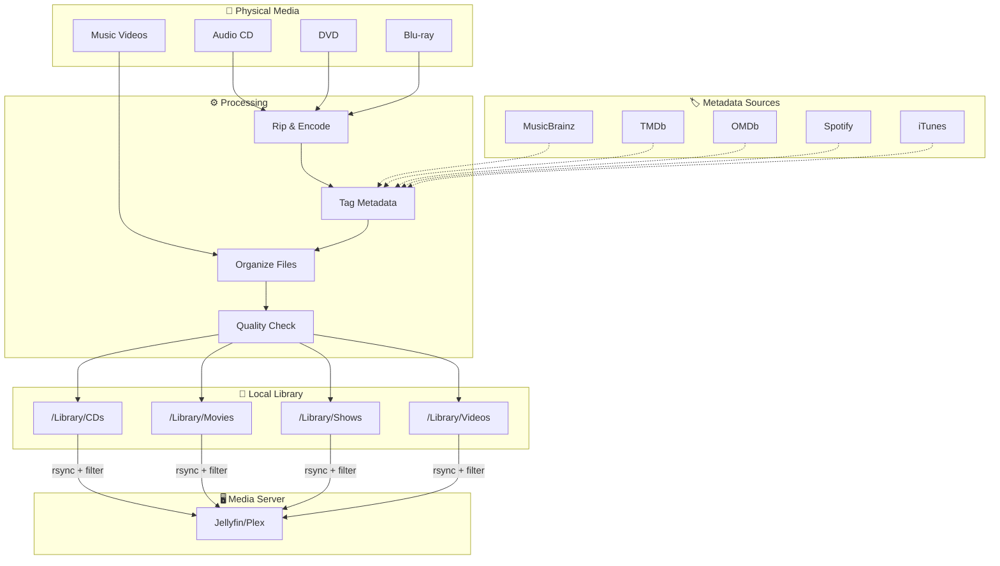
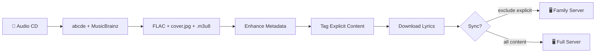
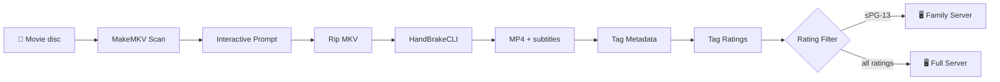

# Workflow Overview (Physical Media → Digital Archive)

This repository provides a unified CLI (`dam`) for three primary workflows:

- **🎵 Audio CDs → FLAC library → tagging → optional sync to a server**
- **🎬 Movie discs → MP4 library → subtitles/organization → server-ready layout**
- **🎥 Music Videos → organize → standardize → sync with other video content**

Each step uses the `dam` command or links to detailed guides.

📖 **For the complete music pipeline from ALL sources to Jellyfin, see `docs/music_collection_guide.md`**

---

## 🏛️ Philosophy: Curated Library + Filtered Sync

### Local Library = Curated Archive
Your **LIBRARY_ROOT** is your permanent, curated collection:
- **Physical media → Digital files** with complete metadata
- **Quality control** through ripping, tagging, and organization
- **No filtering** - everything is preserved in high quality
- **Single source of truth** for your entire media collection

### Sync = Filtered Distribution
**`dam sync`** applies final filters when distributing to servers:
- **Content filtering**: Exclude explicit content, unknown ratings, etc.
- **Target-specific**: Different rules for family vs. full servers
- **Remote by default**: Usually syncs to media servers (Jellyfin/Plex)
- **Optional local**: Can also sync to backup drives or other storage

### Example Workflow
```
Physical Media → [RIP + TAG] → Local Library (curated)
                                   ↓
                               [SYNC + FILTERS]
                                   ↓
                            Remote Server (filtered)
```

This separation lets you maintain a **perfect archive locally** while **syncing filtered content** to different destinations.

---

## System Overview



---

## Workflow A: CDs → FLACs → tagging → sync



### A1) Rip CD to FLAC (MusicBrainz + cover + playlist)
- Guide: `docs/music_collection_guide.md` (Source 1: Audio CDs)
- Commands:
  - `dam rip cd` (unified CLI)
  - `make rip-cd` (Makefile shortcut)

Output (default):
- `${LIBRARY_ROOT}/CDs/Artist/Album/NN - Title.flac`
- `cover.jpg`
- `Album.m3u8`

### A2) Normalize/fix an existing album folder (optional)
- Commands:
  - `dam tag fix-album` (unified CLI)
  - `bin/music/fix_album.py` (direct script)
  - Renames tracks to `NN - Title.flac`
  - Rebuilds playlist
  - Fixes tags and cover art

### A3) Download lyrics (optional)
- Commands:
  - `dam tag lyrics` (unified CLI)
  - `bin/music/download_lyrics.py` (direct script)
- Fetches lyrics from Genius API (falls back to free sources if no key)

### A4) Tag explicit content (optional)
- Commands:
  - `dam tag explicit` (unified CLI)
  - `bin/music/tag-explicit-mb.py` (direct script)
- Writes per-track tag: `EXPLICIT=Yes|No|Unknown`

### A5) Sync to a destination server while excluding explicit/unknown (optional)
- Commands:
  - `dam sync` (unified CLI)
  - `bin/sync/sync-library.py` (direct script)
- Excludes are driven by the `EXPLICIT` tag:
  - `--exclude-explicit` skips `EXPLICIT=Yes`
  - `--exclude-unknown` skips `EXPLICIT=Unknown` and missing tags

---

## Workflow B: Movie discs → MP4s → organize/subtitles → server



### B1) Rip discs to staging (MKV/MP4)
- Guide: `docs/video_ripping_guide.md`
- Commands:
  - `dam rip video` (unified CLI)
  - `make rip-video` (staging)
  - `make rip-movie TITLE="Movie Name" YEAR=1999` (organize main feature)
- Features: Automatic disc scanning, interactive subtitle processing prompt before ripping, automatic compression for large MKVs.
- **MakeMKV is optional for DVDs**: If MakeMKV is not installed, the script will automatically use HandBrake CLI directly for DVD ripping. Blu-ray ripping still requires MakeMKV due to encryption.

### B2) Organize into a server-friendly layout
- Guide: `docs/media_server_setup.md`
- Recommended:
  - Movies: `.../Movies/Movie Name (Year)/Movie Name (Year).mp4`
  - TV: `.../TV/Show Name/Season 01/Show Name - S01E01 - Episode Title.mp4`

### B3) Ensure subtitles are present (optional)
- Video guide covers:
  - English subtitle selection/burn-in policies
  - Backfilling English soft subs into existing MP4s

### B4) Tag movie metadata and ratings (optional)
- Commands:
  - `dam tag metadata` (unified CLI)
  - `dam tag ratings` (unified CLI)
  - `bin/video/tag-movie-metadata.py` — rich metadata (plot/genres/cast/artwork) via TMDb/OMDb
  - `bin/video/tag-movie-ratings.py` — MPAA rating tag (`©rat`) via TMDb/OMDb + overrides/cache

---

## Workflow C: TV Shows → organize → metadata → server


### C1) Organize TV shows into Jellyfin-compatible format
- Commands:
  - `bin/tv/rename_shows_jellyfin.py` (direct script)
- Output: `.../TV/Show Name/Season 01/Show Name - S01E01 - Episode Title.ext`
- Handles various input formats and normalizes to Jellyfin naming conventions

### C2) Tag TV show metadata (optional)
- Commands:
  - `bin/tv/tag-show-metadata.py` (direct script)
- Fetches show metadata from TMDb
- Adds proper series/season/episode metadata

---

## Workflow D: Music Videos → organize → standardize → sync


### D1) Organize music videos into artist folders
- Commands:
  - `dam tag music-videos` (unified CLI)
  - `bin/video/fix_music_videos.py` — Uses MusicBrainz/AcoustID to identify and organize videos
- Output: `${LIBRARY_ROOT}/Videos/Music/Artist/Title.mp4`

### D2) Standardize filenames and metadata (optional)
- Commands:
  - `dam tag standardize` (unified CLI)
  - **Filename standardization:** `bin/video/standardize_music_video_filenames.py`
  - **Metadata scanning:** `bin/video/scan_music_video_metadata.py`
  - Ensures all files follow `{artist} - {title}.mp4` format
  - Handles both MP4 and MP3 files
  - Uses existing metadata or falls back to directory/filename parsing

### D3) Sync to server alongside other video content
- Commands:
  - `dam sync` (unified CLI)
  - Configuration: `bin/sync/sync-config.yaml`
- Destination: `/mnt/media/Videos` (syncs entire Videos directory including Music subfolder)
- No rating filtering applied to music videos
- Integrated with master sync orchestration
